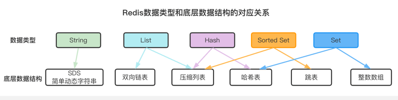
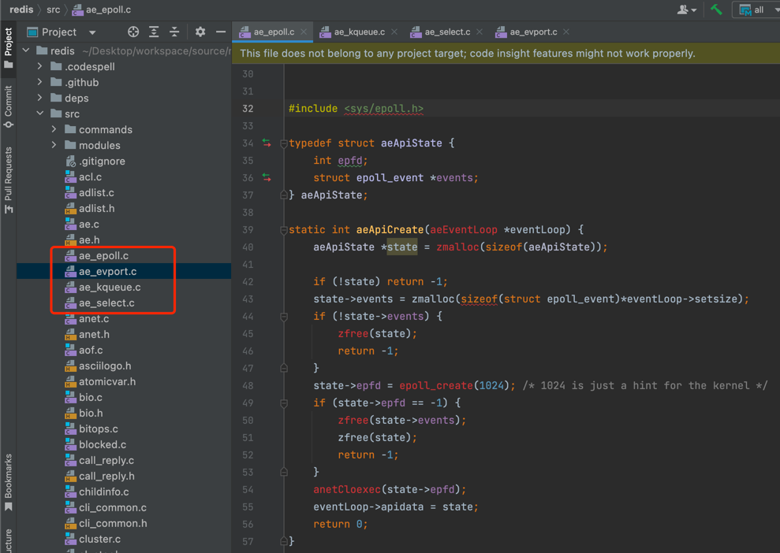
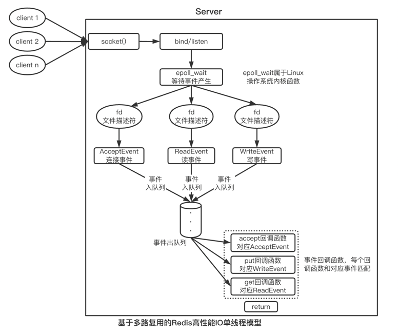

---
layout: post
title: Redis到底是单线程还是多线程，看完这篇就懂了
category: redis
tags: [redis]
excerpt: 有人说redis是单线程，有人说redis是多线程，那么redis到底是单线程还是多线程呢？
--- 
你好，我是Weiki，欢迎来到猿java。

## 背景
 Redis作为Nosql数据库的天花板，在工作中经常遇到同事争论，有人说redis是单线程，有人说redis是多线程，特别是在面试中，这更是一个高频的问题，那么Redis到底是单线程还是多线程，今天我们就来聊一聊

## Redis是单线程
传统意义上的单线程，主要是指接收请求 -> 解码 -> 业务处理 -> 编码 -> 响应请求 这些动作都是在一个线程中执行，那么Redis的单线程是否也是如此？

## Redis也是多线程

在微服务和分布式的时代，各大语言都在争相使用多线程来提高处理能力，为什么Redis要使用单线程呢？

Redis的单线程，主要是指Redis的网络IO和键值对读写是在一个线程来完成，而从Redis4.0开始，比如持久化、异步删除、集群数据同步等操作是由额外的线程执行的。

所以严格来说，Redis并不是单线程，它和传统意义上的单线程也是不一样的。

在Java中使用多线程，当线程间存在共享资源时，就可能会出现线程安全的问题，为了保护共享资源的并发访问，我们会引入各种锁的机制，这也无形中降低系统代码的易调试性和可维护性；另外，指令是在cpu中执行，多线程也会带来cpu的上下文切换损耗，所以Redis直接采用了单线程模式天然来解决多线程带来的问题

## 为什么Redis这么快？
### 内存操作
redis大部分指令操作是在内存上完成，这是Redis快的最主要的原因。内存是属于硬件的范畴，下面给出一张

### 高效的数据结构

在Redis中，除了String外，每种数据类型底层都对应了2种数据结构(不同的数据量使用不同的底层结构)，足以看出官方这种对性能的极致追求。

关于底层各个数据结构，我会在下一次文章中从源码级别去讲解，这样我们在选择一种数据数据类型的时候，就能很好的知道它的使用场景以及性能

### IO多路复用
通过redis的源码可以看到redis使用了IO多路复用机制,不同的环境下次有不同的实现机制

在Linux环境下，Redis采用了epoll机制，一个线程可以同时处理多个IO流，下图为基于多路复用的Redis IO模型，该模型使得Redis可以同时和多个客户端连接并处理请求，从而提升并发性。

想了解更多IO多路复用机制，可以参考我往前的文章：[深度剖析IO多路复用机制](https://mp.weixin.qq.com/s?__biz=MzIwNDAyOTI2Nw==&mid=2247483861&idx=1&sn=5d47f77b3c863cd615dc071a189f620d&chksm=96c72de9a1b0a4ff463752074ea8137b00e2a5e3511cde1c46e81e11727e5316239e412fd83d&token=210527247&lang=zh_CN#rd)

### 单线程模型
单线程模型可以很好的避免多线程环境下CPU不必要的上下文切换和竞争锁带来的消耗

## 最后
如果你觉得本博文对你有帮助，感谢转发给更多的好友，我们将为你呈现更多的干货， 感谢关注公众号：猿java

