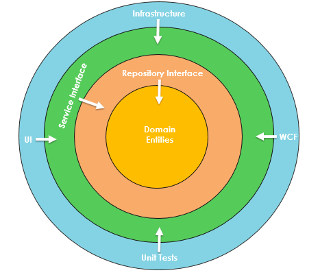
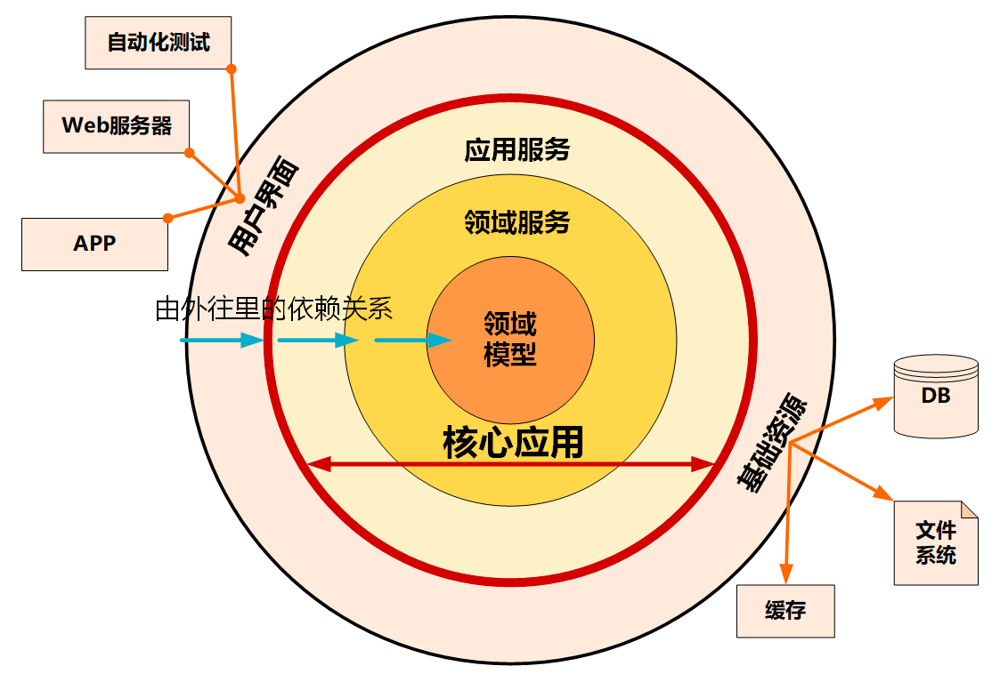

你好，我是Weiki，欢迎来到猿java。

在微服务架构模型中，常见的有洋葱架构，六边形架构，DDD分层架构，

## 六边形架构

这个概念是由 Alistair Cockburn 于2005年在[这篇文章](https://alistair.cockburn.us/hexagonal-architecture/)中介绍的

## 洋葱架构

洋葱架构由 Jeffrey Palermo于2008年在[这篇文章](https://jeffreypalermo.com/2008/07/the-onion-architecture-part-1/)中介绍，
目的是从更好的可测试性、可维护性和可靠性的角度来提供构建应用程序的更好方法。

基于控制反转原理。洋葱架构由多个同心层组成，这些层相互连接，指向代表领域的核心。该架构不像经典的多层架构那样依赖于数据层，而是依赖于实际的领域模型。

### 洋葱架构的层次有哪些？

**领域层**

领域层，位于洋葱架构的最中心，它代表业务和行为对象。这个想法是让你所有的领域对象都在这个核心。它包含所有应用程序域对象。除了域对象之外，您还可以拥有域接口。这些域实体没有任何依赖关系。域对象也应该是扁平的，没有任何繁重的代码或依赖项。

**存储层**

该层在应用程序的域实体和业务逻辑之间创建抽象。在这一层中，我们通常添加接口，这些接口通常通过涉及数据库来提供对象保存和检索行为。该层由数据访问模式组成，这是一种更松散耦合的数据访问方法。我们还创建了一个通用存储库，并添加查询以从源检索数据，将数据从数据源映射到业务实体，并将业务实体中的更改持久化到数据源。

**服务层**

服务层包含具有常用操作的接口，例如添加、保存、编辑和删除。此外，该层用于在 UI 层和存储库层之间进行通信。服务层还可以保存实体的业务逻辑。在这一层中，服务接口与其实现保持分离，牢记松散耦合和关注点分离。

**界面层**

它是最外层，保留 UI 和测试等外围问题。对于 Web 应用程序，它代表 Web API 或单元测试项目。该层实现了依赖注入原理，使应用程序构建了一个松散耦合的结构，并可以通过接口与内部层进行通信。

洋葱架构的实现
Onion Architecture 指南没有提供关于如何实现这些层的方向。架构师应该决定实现，并且可以自由选择任何级别的类、包、模块或任何其他需要添加到解决方案中的内容。

## 整洁架构

整洁架构是由 Robert “Uncle Bob” Martin 于 2012 年在[这篇文章](https://blog.cleancoder.com/uncle-bob/2012/08/13/the-clean-architecture.html)中介绍的

## DDD分层架构

## 最后
如果你觉得本文章对你有帮助，感谢转发给更多的好友，我们将为你呈现更多的干货， 欢迎关注公众号：猿java

